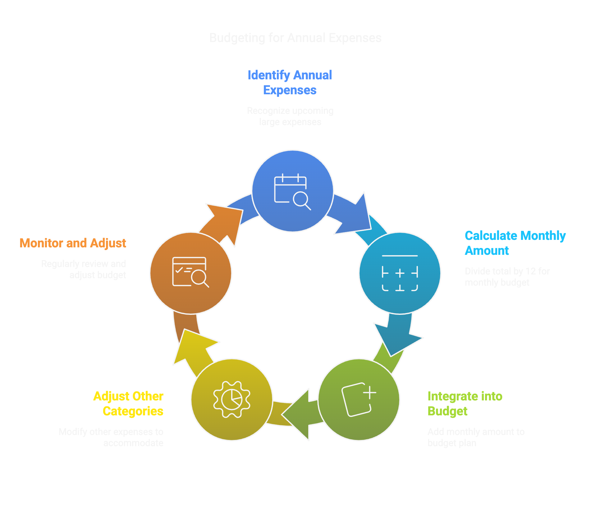

It could happen that once a year, we have big expenses outside of our fixed ones. In my case, for example, it happened with my annual transport subscription. 
Now we can handle the fixed month expenses but how can we handle this unexpected one?
 
 
When I started budgeting, I just didn’t handle it, when the big expenses arrived, I just withdrew some extra money from the piggy bank and pay it. In the last period, I started handle it like installment way. I see what is the amount I need to pay and divide it by 12. Once I have the monthly installment I just treat it like a fixed expense and I add it to my budget process.
 
 
For example, if the annual expense is 300€, the fixed monthly amount becomes 300/12 = 25€.
 
 
This helps a lot because once we need to pay a big amount, we already set aside the amount in the previous months and it doesn’t become a headache. On the other side, this will increase our fixed expenses and it could become a problem if we don’t have the budget for it, but we can reduce the budget of some other categories and make space for this new outflow.
 
 
This is a little tip that makes a big difference to avoid feeling overwhelmed with a lot of things to pay for altogether.
 

